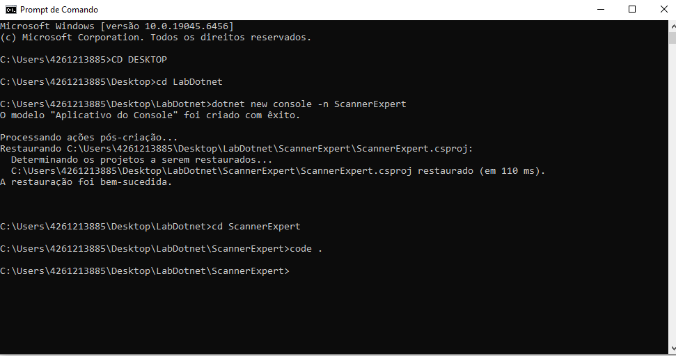
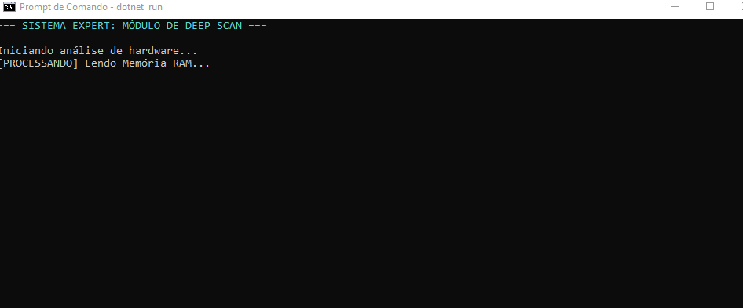
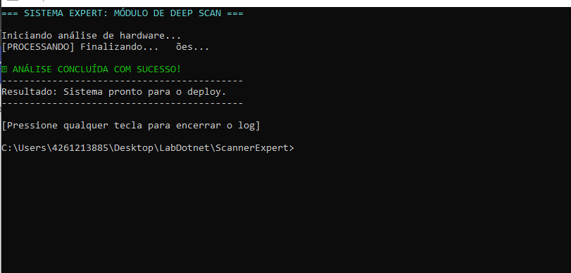

Você já sabe criar e rodar. Agora, você vai aprender a comunicar.

A 1ª Heurística de Nielsen (Visibilidade do Status do Sistema) diz que o software deve sempre manter o usuário informado sobre o que está acontecendo, através de feedback apropriado e em tempo razoável.

Nesta missão, vamos implementar um simulador de varredura de sistema que utiliza essa heurística para evitar que o usuário ache que o programa "travou".

🛠️ O Algoritmo da Entrega
1. Preparar o Terreno (Novo Repositório)
Desta vez, crie um novo repositório público no GitHub com o nome: una-ihcux-lista03

2. O Desafio do "Scanner de Sistema"
Siga a sequência no seu terminal:

Navegue até sua pasta de projetos (cd LabDotnet)
Crie o novo projeto de console: dotnet new console -n ScannerExpert
Entre na pasta: cd ScannerExpert
Abra no VS Code: code .
3. Implementando a Visibilidade de Status
Substitua o conteúdo do Program.cs por este código. Note o uso de loops e o comando Thread.Sleep para simular o tempo de processamento:

using System;
using System.Threading;

// --- UX / IHC: Visibilidade do Status do Sistema ---
Console.Clear();
Console.ForegroundColor = ConsoleColor.Cyan;
Console.WriteLine("=== SISTEMA EXPERT: MÓDULO DE DEEP SCAN ===");
Console.ResetColor();

Console.WriteLine("\nIniciando análise de hardware...");

// Lista de tarefas para simular o progresso
string[] fases = { 
    "Verificando CPU...", 
    "Lendo Memória RAM...", 
    "Sincronizando SDK...", 
    "Validando Permissões...",
    "Finalizando..." 
};

foreach (string fase in fases)
{
    // O caractere \r faz o cursor voltar ao início da linha sem pular para a próxima
    Console.Write($"\r[PROCESSANDO] {fase}   ");

    // Simula um processamento de 1.5 segundos (1500 milissegundos)
    Thread.Sleep(1500); 
}

Console.ForegroundColor = ConsoleColor.Green;
Console.WriteLine("\n\n✅ ANÁLISE CONCLUÍDA COM SUCESSO!");
Console.ResetColor();

Console.WriteLine("-------------------------------------------");
Console.WriteLine("Resultado: Sistema pronto para o deploy.");
Console.WriteLine("-------------------------------------------");

Console.WriteLine("\n[Pressione qualquer tecla para encerrar o log]");
Console.ReadKey();
📸 Registro de Evidência (A "Prova do Crime")
Tire um print do terminal no momento em que a análise estiver acontecendo (mostrando a mensagem de .[lista3part1])
Tire um print do terminal no momento em que a análise estiver acontecendo (mostrando a mensagem de .[lista3part3]).
Tire um print do terminal no momento em que a análise estiver acontecendo (mostrando a mensagem de .(/lista3part2.png)

Isso prova que seu sistema está informando o status em tempo real conforme a heurística de Nielsen.

